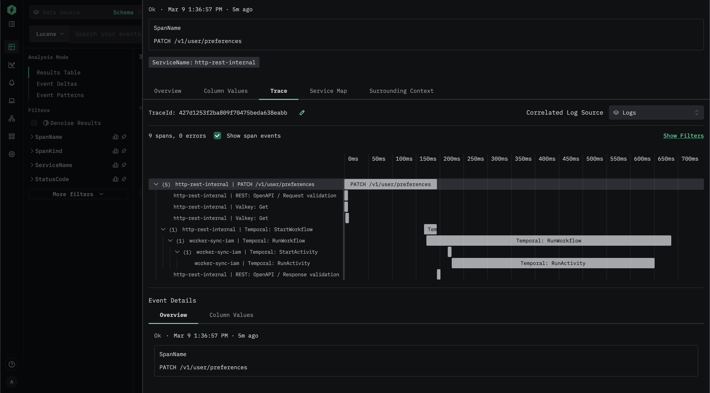

# helix.go

[](https://pkg.go.dev/github.com/mountayaapp/helix.go)
[](https://goreportcard.com/report/github.com/mountayaapp/helix.go)
[](https://github.com/mountayaapp/helix.go/releases/latest)
[](https://opensource.org/licenses/MIT)

helix is a Go library for building microservices with
[OpenTelemetry](https://opentelemetry.io/) observability built in. Every
integration — REST, GraphQL, Temporal, database connections, etc. — ships with
distributed tracing, structured logging, error recording, and health checks. No
manual instrumentation, no boilerplate.

## Quick start

```sh
$ go get github.com/mountayaapp/helix.go
```

Configure an integration, register routes, start, and stop:

```go
package main

import (
  "context"
  "net/http"

  "github.com/mountayaapp/helix.go/integration/rest"
  "github.com/mountayaapp/helix.go/service"
)

func main() {

  // Create a REST API. The constructor automatically registers the server via
  // service.Serve().
  router, err := rest.New(rest.Config{
    Address: ":8080",
  })
  if err != nil {
    panic(err)
  }

  router.POST("/users/:id", func(rw http.ResponseWriter, req *http.Request) {
    params, _ := rest.ParamsFromContext(req.Context())
    userID := params["id"]

    // Your business logic here...
    _ = userID

    rest.NewResponseSuccess[rest.NoMetadata, rest.NoData](req).
      SetStatus(http.StatusCreated).
      Write(rw)
  })

  // Start the service. Blocks until an interrupt signal is received.
  ctx := context.Background()
  if err := service.Start(ctx); err != nil {
    panic(err)
  }

  // Gracefully stop: server drains first, then dependencies close concurrently.
  if err := service.Stop(ctx); err != nil {
    panic(err)
  }
}
```

That's it. The REST API already emits OpenTelemetry traces for every request,
records errors, and exposes a health endpoint at `GET /health` — no additional
setup required.

The screenshot below shows an actual distributed trace from
[Mountaya](https://mountaya.com/)'s production, where helix powers all backend
services. An HTTP Internal API (blue, via REST API) flows into a Temporal
worker (pink) — with full `event.Event` context preserved end-to-end. Developers
only wrote business logic; all observability is handled by helix.



## Why helix

- **Zero-config observability.** All integrations automatically emit distributed
  traces and record errors via OpenTelemetry. You get real-time visibility into
  service health and performance without writing instrumentation code.

- **End-to-end event propagation.** The `event.Event` object travels across service
  boundaries through distributed tracing context. Attach it once and every
  downstream service — REST handlers, Temporal workflows, database calls — can
  access the full event for debugging, monitoring, and analytics.

- **Consistent error handling.** The `errorstack` package provides structured,
  composable errors with validation support across every integration. Same schema,
  same behavior, everywhere.

- **Type-safe by default.** No `interface{}`. helix uses Go generics to enforce
  type safety at every layer — from HTTP response builders to event propagation —
  catching bugs at compile time instead of runtime.

- **Spec-driven development.** Define your API contract first, then implement.
  The REST integration validates requests and responses against your
  [OpenAPI](https://www.openapis.org/) spec at runtime, catching contract
  violations before they reach production. The GraphQL integration uses
  [gqlgen](https://gqlgen.com/)'s schema-first approach — your SDL schema
  generates types and resolvers, keeping implementation in sync with the spec.

- **Managed service lifecycle.** `service.Start()` and `service.Stop()` handle
  signal trapping, graceful shutdown ordering, and concurrent dependency cleanup.
  One server, many dependencies, all managed for you.

## Integrations

Every integration in helix is opinionated by design: distributed tracing, error
recording, structured logging, and health checks are built in. You get
production-grade observability from the first line of code.

### How integrations work

helix models integrations as two types that map to the service lifecycle:

| | Server | Dependency |
|---|---|---|
| **Role** | Defines how the service accepts work | Connects to an external system |
| **Interface** | `integration.Server` | `integration.Dependency` |
| **Cardinality** | One per service | Many per service |
| **Constructor** | `New()` | `Connect()` |
| **Registration** | Automatic via `service.Serve()` | Automatic via `service.Attach()` |
| **Startup** | Blocking — listens for incoming work | Eager — connects in constructor |
| **Shutdown** | Stopped first (drains in-flight work) | Closed concurrently after server stops |

Temporal is the only integration that can act as either: `temporal.New()` registers
a worker (server), while `temporal.Connect()` registers a client-only dependency.

Constructors handle registration automatically — you never need to call
`service.Serve()` or `service.Attach()` directly.

### Servers

Servers define how a service receives and processes work. Only one server can be
registered per service.

- **[REST API](./integration/rest/README.md)** — HTTP router with OpenAPI
  validation, typed responses, and path parameters.
- **[Temporal worker](./integration/temporal/README.md)** — Workflow and activity
  worker with automatic tracing across workflow executions.

### Dependencies

Dependencies connect to external systems. Multiple dependencies can be attached
to a single service.

- **[Temporal](./integration/temporal/README.md)** — Temporal client for starting
  and scheduling Temporal workflows.
- **[PostgreSQL](./integration/postgres/README.md)** — Transactional database
  (also supports CockroachDB, Neon, AlloyDB, and other PostgreSQL-compatible
  databases).
- **[ClickHouse](./integration/clickhouse/README.md)** — Analytical database
  optimized for batch writes and columnar queries.
- **[Valkey](./integration/valkey/README.md)** — In-memory key/value store for
  caching.
- **[Bucket](./integration/bucket/README.md)** — Blob storage with drivers for AWS
  S3, Azure Blob Storage, Google Cloud Storage.

### Shutdown order

When `service.Stop()` is called:

1. The server's `Stop()` is called first, draining in-flight work.
2. All dependencies' `Close()` methods run concurrently once the server is idle.

This guarantees the server stops accepting new work before any dependency connection
is torn down.

## Examples

<details>
  <summary>Event propagation across services</summary>

  The `event.Event` object carries context (like `UserId`) across service
  boundaries, automatically tied to the distributed trace. Downstream services
  receive it without any manual serialization.

  ```go
  import (
    "github.com/mountayaapp/helix.go/event"
    "github.com/mountayaapp/helix.go/integration/rest"
  )

  router.POST("/anything", func(rw http.ResponseWriter, req *http.Request) {
    var e = event.Event{
      // ...
    }

    // Attach the event to the context.
    ctx := event.ContextWithEvent(req.Context(), e)

    // The event is automatically propagated to downstream services via ctx.
    // For example, a Temporal workflow will receive it through distributed tracing.
    wr, err := TemporalWorkflow.Execute(ctx, client, opts, payload)
    if err != nil {
      rest.NewResponseError[rest.NoMetadata](req).
        SetStatus(http.StatusServiceUnavailable).
        Write(rw)
      return
    }

    rest.NewResponseSuccess[rest.NoMetadata, rest.NoData](req).
      SetStatus(http.StatusAccepted).
      Write(rw)
  })
  ```
</details>

<details>
  <summary>Structured logging with automatic context</summary>

  Logs are automatically enriched with the current trace and `event.Event` from
  the context. No need to manually pass IDs or correlation keys — log correlation
  is built in.

  ```go
  import (
    "github.com/mountayaapp/helix.go/event"
    "github.com/mountayaapp/helix.go/integration/rest"
    "github.com/mountayaapp/helix.go/telemetry/log"
  )

  router.POST("/anything", func(rw http.ResponseWriter, req *http.Request) {
    var e = event.Event{
      // ...
    }

    ctx := event.ContextWithEvent(req.Context(), e)

    // This log entry is automatically tied to the current trace and event.
    log.Debug(ctx, "processing request for user", e.UserId)

    rest.NewResponseSuccess[rest.NoMetadata, rest.NoData](req).
      SetStatus(http.StatusAccepted).
      Write(rw)
  })
  ```
</details>

<details>
  <summary>Custom tracing spans</summary>

  Beyond the automatic traces provided by integrations, you can create child spans
  for fine-grained performance analysis of internal logic.

  ```go
  import (
    "github.com/mountayaapp/helix.go/integration/rest"
    "github.com/mountayaapp/helix.go/telemetry/log"
    "github.com/mountayaapp/helix.go/telemetry/trace"
  )

  router.POST("/anything", func(rw http.ResponseWriter, req *http.Request) {

    // Start a child span of the current HTTP request trace.
    ctx, span := trace.Start(req.Context(), trace.SpanKindClient, "fetch-external-data")
    defer span.End()

    // Logs within this span are tied to both the parent trace and this span.
    log.Debug(ctx, "calling external service")

    rest.NewResponseSuccess[rest.NoMetadata, rest.NoData](req).
      SetStatus(http.StatusAccepted).
      Write(rw)
  })
  ```
</details>

<details>
  <summary>Structured error handling</summary>

  The `errorstack` package provides composable errors with validation support,
  used consistently across all integrations.

  ```go
  import (
    "github.com/mountayaapp/helix.go/errorstack"
  )

  stack := errorstack.New("Failed to initialize Stripe client", errorstack.WithIntegration("stripe"))
  stack.WithValidations(errorstack.Validation{
    Message: fmt.Sprintf("%s environment variable must be set and not be empty", envvar),
  })

  if stack.HasValidations() {
    return stack
  }
  ```
</details>

## Environment variables

- **`ENVIRONMENT`** — Current environment name. When set to `local`, `localhost`,
  `dev`, or `development`, the logger outputs at `debug` level. All other values
  default to `info` level.
- **`OTEL_SDK_DISABLED`** — Set to `true` to disable exporting OpenTelemetry logs
  and traces to the OTLP endpoint. Default: `false`.
- **`OTEL_EXPORTER_OTLP_ENDPOINT`** — OTLP gRPC endpoint for exporting logs and
  traces. Example: `localhost:4317`.

## Orchestrators and cloud providers

helix automatically detects the orchestrator or cloud provider a service runs on.
When recognized, traces and logs are enriched with platform-specific attributes.

<details>
  <summary>Kubernetes</summary>

  Additional trace attributes:

  - `kubernetes.namespace`
  - `kubernetes.pod`

  Additional log fields:

  - `kubernetes_namespace`
  - `kubernetes_pod`
</details>

<details>
  <summary>Nomad</summary>

  Additional trace attributes:

  - `nomad.datacenter`
  - `nomad.job`
  - `nomad.namespace`
  - `nomad.region`
  - `nomad.task`

  Additional log fields:

  - `nomad_datacenter`
  - `nomad_job`
  - `nomad_namespace`
  - `nomad_region`
  - `nomad_task`
</details>

<details>
  <summary>Render</summary>

  Additional trace attributes:

  - `render.instance_id`
  - `render.service_id`
  - `render.service_name`
  - `render.service_type`

  Additional log fields:

  - `render_instance_id`
  - `render_service_id`
  - `render_service_name`
  - `render_service_type`
</details>

## License

Repository licensed under the [MIT License](./LICENSE.md).
