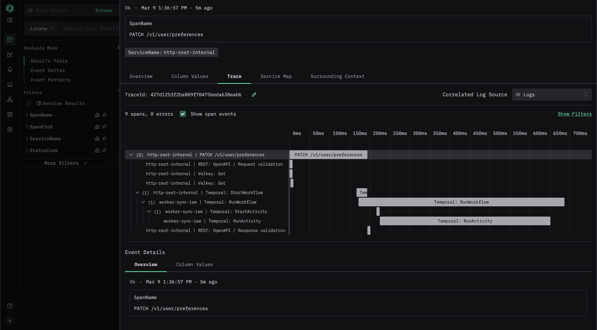

# helix.go

[](https://pkg.go.dev/github.com/mountayaapp/helix.go)
[](https://goreportcard.com/report/github.com/mountayaapp/helix.go)
[](https://github.com/mountayaapp/helix.go/releases/latest)
[](https://opensource.org/licenses/MIT)

helix is a Go library for building observable microservices. Every integration
— REST, GraphQL, Temporal, PostgreSQL, and more — ships with distributed tracing,
structured logging, error recording, and health checks via
[OpenTelemetry](https://opentelemetry.io/). No manual instrumentation, no
boilerplate.

## Why helix

- **Zero-config observability.** All integrations emit distributed traces, structured
  logs, and record errors via OpenTelemetry out of the box.

- **Solid foundations.** Every integration is thread-safe, connection-pooled,
  and heavily tested. Built for services that handle real traffic at scale.

- **End-to-end context propagation.** Attach an `event.Event` once and it travels
  across service boundaries — REST handlers, Temporal workflows, database calls —
  through the distributed tracing context.

- **Consistent error handling.** The `errorstack` package provides structured,
  composable errors with validation support. Same schema, same behavior, across
  every integration.

- **Type-safe by default.** Go generics enforce type safety at every layer — from
  HTTP response builders to event propagation — catching bugs at compile time.

- **Spec-driven APIs.** The REST integration validates requests and responses against
  your [OpenAPI](https://www.openapis.org/) spec at runtime. The GraphQL integration
  uses [gqlgen](https://gqlgen.com/)'s schema-first approach with generated types
  and resolvers.

- **Managed lifecycle.** `svc.Start()` and `svc.Stop()` handle signal trapping,
  graceful shutdown ordering, and concurrent dependency cleanup.

## Requirements

- Go 1.25 or later

## Quick start

```sh
$ go get github.com/mountayaapp/helix.go
```

```go
package main

import (
  "context"
  "net/http"

  "github.com/mountayaapp/helix.go/service"
  "github.com/mountayaapp/helix.go/integration/rest"
)

func main() {

  // Create the Service. It auto-detects the cloud provider
  // and sets up OpenTelemetry for logging and tracing.
  svc, err := service.New()
  if err != nil {
    panic(err)
  }

  // Create a REST API on port 8080.
  router, err := rest.New(svc, rest.Config{
    Address: ":8080",
  })
  if err != nil {
    panic(err)
  }

  router.GET("/hello", func(rw http.ResponseWriter, req *http.Request) {
    rest.NewResponseSuccess[rest.NoMetadata, rest.NoData](req).
      SetStatus(http.StatusOK).
      Write(rw)
  })

  // Start blocks until an interrupt signal is received.
  ctx := context.Background()
  if err := svc.Start(ctx); err != nil {
    panic(err)
  }

  // Gracefully stop: server drains first, then dependencies
  // close, then telemetry is flushed.
  if err := svc.Stop(ctx); err != nil {
    panic(err)
  }
}
```

The REST API already emits OpenTelemetry traces for every request, records errors,
and exposes liveness (`GET /health`) and readiness (`GET /ready`) probes — no
additional setup required.

## Viewing traces and logs locally

helix exports traces and logs via OTLP. To see them locally, you can start an
all-in-one observability stack with [ClickStack](https://clickhouse.com/clickstack):

1. Start ClickStack:

   ```sh
   $ docker run --name clickstack \
     -p 8123:8123 -p 8080:8080 -p 4317:4317 -p 4318:4318 \
     clickhouse/clickstack-all-in-one:latest clickstack
   ```

2. Open `http://localhost:8080`, create your account, then copy your ingestion
   API key from **Team Settings → API Keys**.

3. Run your service with the right environment variables:

   ```sh
   $ OTEL_EXPORTER_OTLP_ENDPOINT=http://localhost:4317 \
     OTEL_EXPORTER_OTLP_HEADERS="Authorization=<your-ingestion-key>" \
     OTEL_EXPORTER_OTLP_INSECURE=true \
     OTEL_SERVICE_NAME=my-service \
     go run .
   ```

You'll see distributed traces for every request in the ClickStack UI.

The screenshot below shows a trace where an HTTP API flows into a Temporal worker
with full event context preserved end-to-end. Developers only wrote business logic;
all observability was handled by helix.



## Core concepts

### Service

The `Service` is the central container. It owns the logger, tracer, and cloud
provider detection, and manages the full application lifecycle. Only one instance
is allowed per application.

```go
svc, err := service.New(
  service.WithShutdownTimeout(10 * time.Second),
)
```

Available options:

- `WithShutdownTimeout(duration)` — Maximum duration for graceful shutdown.
  Defaults to 30 seconds.
- `WithSignals(signals...)` — Override shutdown signals.
  Defaults to `SIGINT`, `SIGTERM`.

Tracing, logging, and exporter configuration are controlled through OpenTelemetry
environment variables (see [Environment variables](#environment-variables)).

### Integrations

helix models integrations as two types that map to the service lifecycle:

| | Server | Dependency |
|---|---|---|
| **Role** | Defines how the service accepts work | Connects to an external system |
| **Interface** | `integration.Server` | `integration.Dependency` |
| **Cardinality** | One per Service | Many per Service |
| **Constructor** | `New(svc, ...)` | `Connect(svc, ...)` |
| **Registration** | Automatic via `service.Serve()` | Automatic via `service.Attach()` |
| **Startup** | Blocking — listens for incoming work | Eager — connects in constructor |
| **Shutdown** | Stopped first (drains in-flight work) | Closed concurrently after server stops |

Constructors handle registration automatically — you never need to call
`service.Serve()` or `service.Attach()` directly.

#### Servers

Servers define how a service receives and processes work. Only one server can be
registered per service.

- **[REST API](./integration/rest/README.md)** — HTTP router with OpenAPI
  validation, typed responses, and path parameters.
- **[GraphQL API](./integration/graphql/README.md)** — GraphQL server with
  schema-first design, optional GraphiQL playground and automatic persisted queries.
- **[Temporal worker](./integration/temporal/README.md)** — Workflow and activity
  worker with automatic tracing across workflow executions.

#### Dependencies

Dependencies connect to external systems. Multiple dependencies can be attached
to a single service.

- **[Temporal](./integration/temporal/README.md)** — Client for starting
  and scheduling workflows.
- **[PostgreSQL](./integration/postgres/README.md)** — Transactional database
  (also supports CockroachDB, Neon, AlloyDB, and other PostgreSQL-compatible
  databases).
- **[ClickHouse](./integration/clickhouse/README.md)** — Analytical database
  optimized for batch writes and columnar queries.
- **[Valkey](./integration/valkey/README.md)** — In-memory key/value store for
  caching.
- **[Bucket](./integration/bucket/README.md)** — Blob storage with drivers for AWS
  S3, Azure Blob Storage, Google Cloud Storage.

> **Note:** Integrations in this repository are maintained exclusively by the helix
> team. We do not accept new integrations via pull requests, but you are free to
> build and publish your own in a separate module.

#### Shutdown order

When `svc.Stop()` is called:

1. The server stops first, draining in-flight work.
2. All dependencies close concurrently once the server is idle.
3. The tracer is flushed and shut down.
4. The logger provider is flushed and shut down.
5. The logger is synced.

This guarantees no dependency connection is torn down while the server is still
processing requests, and all telemetry is flushed before the process exits.

## Examples

<details>
  <summary>Full application with multiple integrations</summary>

  ```go
  package main

  import (
    "context"
    "net/http"

    "github.com/mountayaapp/helix.go/integration/postgres"
    "github.com/mountayaapp/helix.go/integration/rest"
    "github.com/mountayaapp/helix.go/integration/valkey"
    "github.com/mountayaapp/helix.go/service"
    "github.com/mountayaapp/helix.go/telemetry/log"
  )

  func main() {
    svc, err := service.New()
    if err != nil {
      panic(err)
    }

    // Connect dependencies.
    db, err := postgres.Connect(svc, postgres.Config{
      Address:  "127.0.0.1:5432",
      Database: "myapp",
      User:     "postgres",
      Password: "secret",
    })
    if err != nil {
      panic(err)
    }

    cache, err := valkey.Connect(svc, valkey.Config{
      Address: "127.0.0.1:6379",
    })
    if err != nil {
      panic(err)
    }

    // Create the server.
    router, err := rest.New(svc, rest.Config{
      Address: ":8080",
    })
    if err != nil {
      panic(err)
    }

    router.GET("/users/:id", func(rw http.ResponseWriter, req *http.Request) {
      params, _ := rest.ParamsFromContext(req.Context())
      log.Info(req.Context(), "fetching user", log.String("id", params["id"]))

      // Use db and cache here...
      _ = db
      _ = cache

      rest.NewResponseSuccess[rest.NoMetadata, rest.NoData](req).
        SetStatus(http.StatusOK).
        Write(rw)
    })

    ctx := context.Background()
    if err := svc.Start(ctx); err != nil {
      panic(err)
    }

    if err := svc.Stop(ctx); err != nil {
      panic(err)
    }
  }
  ```
</details>

<details>
  <summary>REST API with typed responses</summary>

  The REST integration uses Go generics for type-safe JSON responses. The
  `Metadata` and `Data` type parameters control the shape of the response body.

  ```go
  import (
    "net/http"

    "github.com/mountayaapp/helix.go/errorstack"
    "github.com/mountayaapp/helix.go/integration/rest"
  )

  type UserMetadata struct {
    RequestID string `json:"request_id"`
  }

  type User struct {
    ID   string `json:"id"`
    Name string `json:"name"`
  }

  router.GET("/users/:id", func(rw http.ResponseWriter, req *http.Request) {
    params, _ := rest.ParamsFromContext(req.Context())

    user, err := fetchUser(params["id"])
    if err != nil {

      // Error response — returns {"status":"Not Found","error":{"message":"..."}}
      rest.NewResponseError[rest.NoMetadata](req).
        SetStatus(http.StatusNotFound).
        Write(rw)
      return
    }

    // Success response — returns {"status":"OK","metadata":{...},"data":{...}}
    rest.NewResponseSuccess[UserMetadata, User](req).
      SetStatus(http.StatusOK).
      SetMetadata(UserMetadata{RequestID: "abc-123"}).
      SetData(*user).
      Write(rw)
  })
  ```

  Use `rest.NoMetadata` and `rest.NoData` when you don't need those fields in the
  response.
</details>

<details>
  <summary>Event propagation across services</summary>

  The `event.Event` object carries context (like `UserID`) across service
  boundaries, automatically tied to the distributed trace. Downstream services
  receive it without any manual serialization.

  ```go
  import (
    "net/http"

    "github.com/mountayaapp/helix.go/event"
    "github.com/mountayaapp/helix.go/integration/rest"
  )

  router.POST("/orders", func(rw http.ResponseWriter, req *http.Request) {
    e := event.Event{
      UserID: "usr_123",
    }

    // Attach the event to the context.
    ctx := event.ContextWithEvent(req.Context(), e)

    // The event is automatically propagated to downstream services via ctx.
    // For example, a Temporal workflow will receive it through distributed tracing.
    _, err := OrderWorkflow.Execute(ctx, client, opts, payload)
    if err != nil {
      rest.NewResponseError[rest.NoMetadata](req).
        SetStatus(http.StatusServiceUnavailable).
        Write(rw)
      return
    }

    rest.NewResponseSuccess[rest.NoMetadata, rest.NoData](req).
      SetStatus(http.StatusAccepted).
      Write(rw)
  })
  ```
</details>

<details>
  <summary>Structured logging with automatic context</summary>

  Logs are automatically enriched with the current trace and span IDs from
  the context. No need to manually pass correlation keys.

  ```go
  import (
    "net/http"

    "github.com/mountayaapp/helix.go/integration/rest"
    "github.com/mountayaapp/helix.go/telemetry/log"
  )

  router.POST("/orders", func(rw http.ResponseWriter, req *http.Request) {
    
    // This log entry is automatically tied to the current trace and span.
    log.Info(req.Context(), "processing order",
      log.String("user_id", "usr_123"),
      log.Int("item_count", 3),
    )

    rest.NewResponseSuccess[rest.NoMetadata, rest.NoData](req).
      SetStatus(http.StatusAccepted).
      Write(rw)
  })
  ```

  Available log levels: `log.Debug`, `log.Info`, `log.Warn`, `log.Error`.

  Available field types: `log.String`, `log.Int`, `log.Int64`, `log.Float64`,
  `log.Bool`, `log.Err`, `log.Any`, `log.Duration`.
</details>

<details>
  <summary>Custom tracing spans</summary>

  Beyond the automatic traces provided by integrations, you can create child spans
  for fine-grained performance analysis of internal logic.

  ```go
  import (
    "net/http"

    "github.com/mountayaapp/helix.go/integration/rest"
    "github.com/mountayaapp/helix.go/telemetry/log"
    "github.com/mountayaapp/helix.go/telemetry/trace"
  )

  router.POST("/reports", func(rw http.ResponseWriter, req *http.Request) {

    // Start a child span of the current HTTP request trace.
    ctx, span := trace.Start(req.Context(), trace.SpanKindClient, "fetch-external-data")
    defer span.End()

    // Logs within this span are tied to both the parent trace and this span.
    log.Debug(ctx, "calling external service")

    // Record errors in the span when something goes wrong.
    data, err := callExternalService(ctx)
    if err != nil {
      span.RecordError("external service call failed", err)
    }

    _ = data

    rest.NewResponseSuccess[rest.NoMetadata, rest.NoData](req).
      SetStatus(http.StatusOK).
      Write(rw)
  })
  ```

  Available span kinds: `trace.SpanKindInternal`, `trace.SpanKindServer`,
  `trace.SpanKindClient`, `trace.SpanKindProducer`, `trace.SpanKindConsumer`.
</details>

<details>
  <summary>Structured error handling</summary>

  The `errorstack` package provides composable errors with validation support,
  used consistently across all integrations.

  ```go
  import (
    "fmt"

    "github.com/mountayaapp/helix.go/errorstack"
  )

  // Create a new error with validation details.
  func validateConfig(apiKey string) error {
    stack := errorstack.New("Invalid configuration",
      errorstack.WithIntegration("stripe"),
    )

    if apiKey == "" {
      stack.WithValidations(errorstack.Validation{
        Message: "STRIPE_API_KEY environment variable must be set and not be empty",
      })
    }

    if stack.HasValidations() {
      return stack
    }

    return nil
  }

  // Wrap an existing error with additional context.
  func fetchUser(id string) error {
    user, err := db.QueryRow(ctx, "SELECT * FROM users WHERE id = $1", id)
    if err != nil {
      return errorstack.Wrap(err, fmt.Sprintf("Failed to fetch user %s", id))
    }

    return nil
  }
  ```
</details>

## Environment variables

helix respects all standard
[OpenTelemetry environment variables](https://opentelemetry.io/docs/specs/otel/configuration/sdk-environment-variables/).
The most common ones are listed below.

- `OTEL_SDK_DISABLED` — Set to `true` to disable the OpenTelemetry SDK entirely
  (noop tracer and logger). Default: `"false"`.
- `OTEL_LOG_LEVEL` — Log level (`debug`, `info`, `warn`, `error`).
  Default: `"info"`.
- `OTEL_TRACES_EXPORTER` — Trace exporter (`otlp`, `console`, `none`).
  Default: `"otlp"`.
- `OTEL_LOGS_EXPORTER` — Log exporter (`otlp`, `console`, `none`).
  Default: `"otlp"`.
- `OTEL_EXPORTER_OTLP_PROTOCOL` — OTLP transport protocol (`grpc`, `http/protobuf`).
  Default: `"grpc"`.
- `OTEL_EXPORTER_OTLP_ENDPOINT` — OTLP endpoint for traces and logs.
  Default: `"http://localhost:4317"`.
- `OTEL_EXPORTER_OTLP_HEADERS` — Headers for OTLP requests (e.g. `Authorization=<token>`).
- `OTEL_EXPORTER_OTLP_INSECURE` — Set to `true` to disable TLS.
  Default: `"false"`.
- `OTEL_SERVICE_NAME` — Override the service name resource attribute.
  Default: auto-detected from process.

## Cloud providers

helix automatically detects the orchestrator or cloud provider a service runs on.
When recognized, traces and logs are enriched with platform-specific attributes.

<details>
  <summary>Kubernetes</summary>

  Additional OpenTelemetry attributes (traces and logs exported via OTLP):

  - `kubernetes.namespace`
  - `kubernetes.pod`

  Additional stderr log fields:

  - `kubernetes_namespace`
  - `kubernetes_pod`
</details>

<details>
  <summary>Nomad</summary>

  Additional OpenTelemetry attributes (traces and logs exported via OTLP):

  - `nomad.datacenter`
  - `nomad.job_id`
  - `nomad.job_name`
  - `nomad.namespace`
  - `nomad.region`
  - `nomad.task`

  Additional stderr log fields:

  - `nomad_datacenter`
  - `nomad_job_id`
  - `nomad_job_name`
  - `nomad_namespace`
  - `nomad_region`
  - `nomad_task`
</details>

<details>
  <summary>Render</summary>

  Additional OpenTelemetry attributes (traces and logs exported via OTLP):

  - `render.instance_id`
  - `render.service_id`
  - `render.service_name`
  - `render.service_type`

  Additional stderr log fields:

  - `render_instance_id`
  - `render_service_id`
  - `render_service_name`
  - `render_service_type`
</details>

## Versioning

helix follows [semantic versioning](https://semver.org/). Once v1.0.0 is released,
the public API will remain backwards-compatible within the same major version.
Breaking changes will only be introduced in a new major version with a migration
guide.

## License

Repository licensed under the [MIT License](./LICENSE.md).
